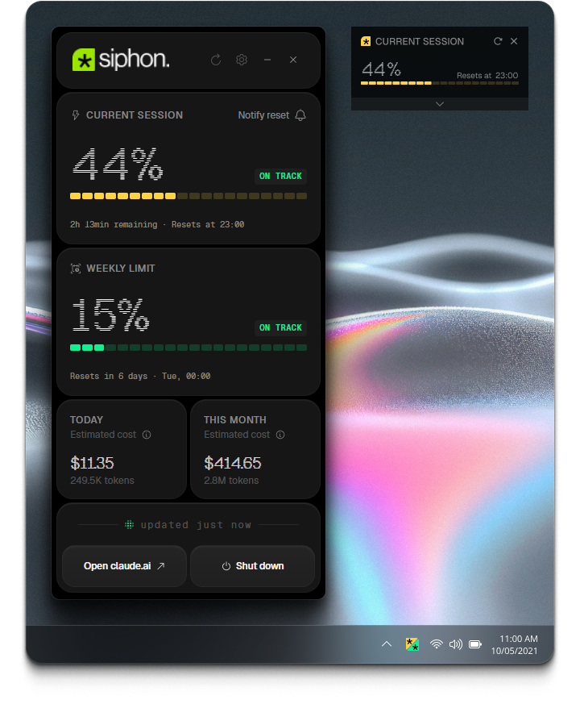

<div align="center">
  
  <br/>
  <br/>
  <p>A Windows tray app that tracks your Claude Code usage in real time.</p>

  [](LICENSE)
  [](https://www.electronjs.org/)
  [](https://nodejs.org/)
  [](https://www.microsoft.com/windows)

  <br/>
  <br/>
  
</div>

---

Siphon sits quietly in your system tray and shows session quota, weekly limits, and daily/monthly costs — all pulled directly from Claude Code's local files and the Anthropic OAuth usage endpoint. No API keys, no configuration: if you use Claude Code, it just works.

The Windows-specific addition is a **reset notification**: when your five-hour session quota hits 100%, Siphon schedules a Windows toast for the exact moment it becomes available again. If the app was closed during that window, it fires the missed notification on the next launch.

This is a Windows port of [appariciojunior/siphonClaudeUsage](https://github.com/appariciojunior/siphonClaudeUsage).

## Features

| | |
|---|---|
| **Session quota** | Live progress bar showing your current 5-hour session usage with a reset countdown |
| **Weekly limits** | Tracks the all-model weekly cap returned by the OAuth usage endpoint |
| **Cost tracking** | Today's and this month's spend in USD, computed locally from Claude Code's usage and pricing files |
| **Reset notification** | Windows toast when your session resets — even if the app was closed when it happened |
| **Floating widget** | Always-on-top mini widget (PiP-style) you can drag anywhere on screen |
| **Configurable refresh** | Local refresh defaults to 30 seconds, with 5, 15, and 30 minute options in Settings |
| **Start with Windows** | Optional autostart, with a separate setting for whether the window appears after login |
| **Pace indicator** | Session and weekly cards show whether your usage pace is on track or likely to exhaust the quota before it resets |
| **Color-coded tray icon** |  - Icon encodes both session and weekly quota levels simultaneously — two independent color channels in one icon |
| **Localization** | UI available in English and Brazilian Portuguese, switchable from Settings |

## Requirements

- Windows 10 or later
- Node.js 22 or later (development only)
- [Claude Code](https://claude.ai/code) installed and used at least once

## Installation

### From the installer (recommended)

Download the latest `Siphon Setup <version>.exe` from [Releases](../../releases) and run it. The installer is per-user — no admin elevation required. A Start Menu entry is created under **Siphon**, and an optional desktop shortcut is offered on the final page.

> [!NOTE]
> Microsoft Defender SmartScreen may show a warning the first time you run the installer since the app isn't code-signed yet. Click **More info → Run anyway** to proceed.

### From source

```powershell
git clone https://github.com/kayodante/siphonClaudeUsage.git
cd siphonClaudeUsage
npm install
npm start
```

To build the installer yourself:

```powershell
npm run build:win
# Output: dist/Siphon Setup <version>.exe
```

## How it works

Siphon runs as three isolated Electron contexts:

```
Main process (Node, ESM)
  ├── UsageController
  │     ├── LocalDataService   — reads ~/.claude readouts or cached project JSONL on the selected cadence
  │     ├── QuotaService       — polls api.anthropic.com/api/oauth/usage with a 120 s minimum
  │     ├── OAuthService       — PKCE sign-in flow (same client ID as Claude Code)
  │     └── ResetNotificationScheduler — arms Windows toasts on quota exhaustion
  └── IPC bridge
Preload (CJS)       — exposes window.siphon.* to the renderer
Renderer (ESM)      — vanilla JS + CSS, no framework
```

Cost figures are computed locally from Claude Code's usage data. Siphon first
uses the legacy token cache (`readout-cost-cache.json`) when present; otherwise
it scans modern per-session JSONL files under `~/.claude/projects/` and keeps an
internal incremental cache so unchanged session files are not re-read. Pricing
comes from `readout-pricing.json` when available, with bundled fallback prices
for known Claude models. No data leaves your machine for cost calculations.

### Data stored on disk

| File | Purpose |
|------|---------|
| `%APPDATA%\Siphon\credentials.json` | OAuth tokens (mode `0600`) |
| `%APPDATA%\Siphon\reset-notification.json` | Pending reset timestamp |
| `%APPDATA%\Siphon\preferences.json` | Language, notification toggle, widget position, autostart and refresh settings |
| `%APPDATA%\Siphon\local-usage-cache.json` | Rebuildable incremental cache for modern Claude Code JSONL usage files |

### Sign-in

Siphon reuses Claude Code's OAuth PKCE flow. When you click **Sign in**, a browser tab opens to Anthropic's auth page. After authorizing, paste the redirect URL back into the app. Tokens are refreshed automatically 30 seconds before expiry.

## Development

```powershell
npm test    # node --test (built-in Node test runner)
npm run lint  # syntax-only check
```

Tests live in `test/` and mirror the `src/main/` module structure. The test for `resetNotificationScheduler.test.js` covers the tricky timer-clamp and persistence paths — run it whenever you touch the scheduler.

See [ARCHITECTURE.md](ARCHITECTURE.md) for a full module map and data-flow diagrams, and [ROADMAP.md](ROADMAP.md) for what's planned next.

## Tech stack

- **[Electron 41](https://www.electronjs.org/)** — `type: "module"` (main process is ESM, preload is CJS)
- **No bundler** — renderer loads `index.html` directly via `loadFile`
- **No UI framework** — vanilla JS and hand-written CSS
- **[Geist](https://vercel.com/font)** — display font (Geist, Geist Mono, Geist Pixel Line)
- **[Carbon Icons](https://carbondesignsystem.com/elements/icons/library/)** — UI iconography

## Privacy

Siphon stores data only on your machine and makes outbound requests exclusively to Anthropic. No telemetry, no analytics, no third-party data sharing. See [docs/privacy-policy.md](docs/privacy-policy.md) for details.

## Code signing

Installers are signed through the [SignPath Foundation](https://signpath.org/) free program for open-source projects. See [docs/code-signing-policy.md](docs/code-signing-policy.md) for the signing policy and team roles.

## Credits

Inspired by [siphonClaudeUsage](https://github.com/appariciojunior/siphonClaudeUsage/) (MIT)

## License

MIT — do whatever you like, attribution appreciated.
