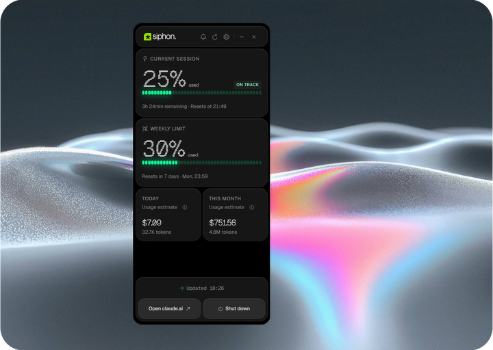

<div align="center">
  
  <br/>
  <br/>
  <p>Um aplicativo para a bandeja do Windows que acompanha o uso do Claude Code em tempo real.</p>

  [](https://github.com/kayodante/Win-siphonClaudeUsage/releases)
  [](https://github.com/kayodante/Win-siphonClaudeUsage/actions/workflows/ci.yml)
  [](https://github.com/kayodante/Win-siphonClaudeUsage/blob/main/LICENSE)
  [](https://tauri.app/)
  [](https://www.rust-lang.org/)
  [](https://nodejs.org/)
  [](https://www.microsoft.com/windows)

  <br/>
  <br/>
  
</div>

<p align="center">
  <a href="README.md">English</a> · <b>Português</b>
</p>

---

O Siphon fica discretamente na bandeja do sistema e mostra a cota da sessão, os limites semanais e o uso diário e mensal. Os dados vêm diretamente dos arquivos locais do Claude Code e do endpoint de uso OAuth da Anthropic. Não é preciso configurar nada nem fornecer chaves de API: se você usa o Claude Code, o Siphon funciona.

O recurso específico do Windows é a **notificação de redefinição**: quando a cota da sessão de cinco horas chega a 100%, o Siphon agenda uma notificação do Windows para o momento exato em que ela fica disponível novamente. Se o aplicativo estava fechado nesse momento, a notificação perdida aparece na próxima abertura.

Esta é uma versão para Windows do [appariciojunior/siphonClaudeUsage](https://github.com/appariciojunior/siphonClaudeUsage).

**[Visite o site →](https://kayodante.github.io/Win-siphonClaudeUsage/)**

## Recursos

* **Cota da sessão** | Barra de progresso da sessão atual de 5 horas, com contagem regressiva até a redefinição
* **Limites semanais** | Acompanha o limite semanal para todos os modelos a partir do endpoint de uso OAuth
* **Acompanhamento do uso** | Uso de hoje e do mês em USD, calculado localmente com os arquivos de uso e preços do Claude Code
* **Alertas de cota** | Avisos na interface quando o uso da sessão chega a 70% e 90% (dispensáveis por sessão); notificações opcionais do Windows aos 70%, 90% e 100%, cada uma configurável separadamente
* **Notificação de redefinição** | Notificação do Windows quando a sessão é redefinida. Se o aplicativo estava fechado, ela aparece na próxima abertura
* **Alertas sonoros** | Três sons (sessão redefinida, cota esgotada e avisos aos 70%/90%), cada um com controle próprio para ativar, testar e ajustar o volume
* **Widget flutuante** | Widget sempre visível que você pode arrastar para qualquer lugar. Dois formatos: clássico (progresso da sessão e painel de estatísticas expansível) ou pílula (ícone compacto e barra de porcentagem)
* **Atualização configurável** | A cada 30 segundos por padrão; opções de 1, 5 e 15 minutos em Configurações
* **Iniciar com o Windows** | Inicialização automática opcional, com uma configuração separada para abrir ou não a janela ao entrar no sistema
* **Abrir com o Claude Code** | Integração opcional que registra um hook `SessionStart` em `~/.claude/settings.json` para abrir o Siphon quando você inicia uma sessão
* **Indicador de ritmo** | Mostra se seu ritmo de uso está adequado ou se você provavelmente atingirá o limite antes da hora
* **Indicador de horário de pico** | Sinaliza o período de pico da Anthropic (dias úteis, das 5h às 11h no horário do Pacífico), quando as cotas se esgotam mais rápido; ajusta automaticamente o horário de verão
* **Ícone colorido na bandeja** |  - Mostra simultaneamente os níveis das cotas da sessão e da semana por meio de duas cores independentes
* **Idiomas** | Inglês, português do Brasil, japonês e coreano, selecionáveis em Configurações

## Requisitos

- Windows 10 ou posterior
- Node.js 22 ou posterior (somente para desenvolvimento)
- [Claude Code](https://claude.ai/code) instalado e utilizado pelo menos uma vez

## Instalação

### Pelo instalador (recomendado)

Baixe o `Siphon Setup <version>.exe` mais recente em [Releases](../../releases) e execute-o. A instalação é feita apenas para o usuário atual, sem exigir permissão de administrador. Uma entrada é criada no menu Iniciar em **Siphon**, e você pode adicionar um atalho à área de trabalho na última etapa.

### Versão portátil

Baixe `Siphon.Portable.<version>.exe` em [Releases](../../releases) e execute-o, sem instalar. Ela precisa do WebView2, que já vem com o Windows 11 e é instalado pela maioria dos aplicativos modernos no Windows 10.

### Pelo winget

```powershell
winget install win-siphon
```

As novas versões passam pela aprovação do [microsoft/winget-pkgs](https://github.com/microsoft/winget-pkgs). Por isso, a versão do winget pode chegar alguns dias depois da versão publicada no GitHub.

## Como funciona

O Siphon é um aplicativo nativo em **Rust/Tauri 2**: um pequeno backend em Rust controla a interface WebView2 por meio do IPC do Tauri.

```
Backend Tauri (Rust)
  ├── crate siphon-core — lógica pura, multiplataforma:
  │     ├── leitura do uso local (~/.claude: readouts + JSONL dos projetos) com cache incremental
  │     ├── consulta da cota em api.anthropic.com/api/oauth/usage (intervalo mínimo de 120 s)
  │     ├── autenticação OAuth PKCE (mesmo client ID do Claude Code), com redirecionamento local
  │     └── agendador de redefinição — programa notificações do Windows quando a cota se esgota
  ├── binário src-tauri — bandeja, widget flutuante, notificações, armazenamento
  │                     de credenciais com DPAPI, atualizador e comandos IPC
  └── IPC (Tauri invoke / event)
Interface (WebView2) — JS + CSS puro, sem framework; window.siphon.* fornecido
                       por src/renderer/siphonBridge.js
```

Os valores de uso são calculados localmente a partir dos dados do Claude Code. O Siphon usa primeiro o cache de tokens antigo (`readout-cost-cache.json`), quando disponível. Caso contrário, lê os arquivos JSONL modernos de cada sessão em `~/.claude/projects/` e mantém um cache incremental interno para não reler arquivos que não mudaram. Os preços vêm de `readout-pricing.json` quando ele está disponível, com preços incluídos no aplicativo como alternativa para modelos Claude conhecidos. Nenhum dado sai do seu computador para calcular o uso.

### Dados armazenados no disco

| Arquivo | Finalidade |
|---------|------------|
| `%APPDATA%\Siphon\credentials.json` | Tokens OAuth (permissão `0600`) |
| `%APPDATA%\Siphon\reset-notification.json` | Horário de redefinição pendente |
| `%APPDATA%\Siphon\preferences.json` | Idioma, notificações, posição do widget e da janela principal, inicialização automática, intervalo de atualização, busca por atualizações, modo de exibição da cota, ocultação do e-mail e integração para abrir com o Claude Code |
| `%APPDATA%\Siphon\local-usage-cache.json` | Cache incremental que pode ser reconstruído a partir dos arquivos JSONL de uso do Claude Code |

### Autenticação

O Siphon reutiliza o fluxo OAuth PKCE do Claude Code. Ao clicar em **Entrar**, uma aba do navegador abre a página de autorização da Anthropic. Depois da aprovação, o navegador envia a autorização diretamente ao Siphon, que escuta em uma porta local temporária no seu computador. Não é preciso copiar nada, e a janela do aplicativo volta a aparecer sozinha. Se essa porta não puder ser aberta, o Siphon pede que você cole a URL de redirecionamento. Enquanto aguarda, ele mostra o link de autorização com um botão para copiá-lo. Assim, mesmo se o navegador não abrir, você pode copiar e colar o link. Há também uma contagem regressiva de 150 segundos. Após 60 segundos, o campo para colar aparece; se o tempo de espera acabar, você ainda pode colar o link que já autorizou. Os tokens são renovados automaticamente 30 segundos antes de expirar.

## Desenvolvimento

```powershell
npm start          # cargo tauri dev — executa a interface em src/renderer
npm run build:win  # cargo tauri build — instalador NSIS
npm test           # node --test — testes de JS da interface e módulos compartilhados (test/)
npm run test:rust  # cargo test -p siphon-core — lógica central em Rust
npm run lint       # verificação de sintaxe + eslint
npm run lint:rust  # cargo fmt --check + cargo clippy, em siphon-core
npm run verify     # todos os comandos acima — verificações exigidas pela CI
```

Para gerar o binário do Windows, instale os [pré-requisitos do Tauri](https://tauri.app/start/prerequisites/) (WebView2 e as ferramentas MSVC), além do `cargo tauri` (tauri-cli). O projeto é dividido para que a lógica do aplicativo possa ser testada em qualquer sistema:

- **`src-tauri/crates/siphon-core`** — biblioteca pura e multiplataforma (sem Tauri nem crate `windows`) que contém a lógica de uso, preços, leitura de JSONL, OAuth PKCE, cota, preferências, agendador de redefinição e atualizador. Tem testes unitários; a CI executa `cargo fmt --check`, `cargo clippy -D warnings` e `cargo test` para ela no Linux.
- **`src-tauri/src`** — binário Tauri para Windows: comandos IPC, controle de estado, bandeja, widget flutuante, armazenamento de credenciais com DPAPI, notificações e atualizador. A compilação completa desse binário não faz parte da CI em Linux porque exige as ferramentas WebView2/NSIS do Windows.

Os testes de JS ficam em `test/` e cobrem `src/shared/`, `src/renderer/viewState.js`, os contratos de marcação da interface e do widget flutuante, além do site estático em `docs/`. O script `scripts/pack-release.ps1` reorganiza o instalador NSIS gerado com o nome usado nas versões publicadas (`Siphon.Setup.<version>.exe` + `.sha256`) e copia o binário portátil da compilação como `Siphon.Portable.<version>.exe`, com seu próprio `.sha256`.

## Privacidade

- **Dois destinos, ambos relacionados ao aplicativo** — os dados de uso e cota vão apenas para a Anthropic (`api.anthropic.com`). O único outro tráfego de saída é a busca por atualizações na API do GitHub Releases e, se você baixar uma atualização, o próprio instalador vindo do GitHub. Nenhum dado sobre seu uso é enviado ao GitHub. Sem telemetria, análises ou compartilhamento de dados com terceiros.
- **Sem varredura do disco** — o aplicativo lê apenas caminhos conhecidos: `~/.claude/readout-*.json`, arquivos JSONL em `~/.claude/projects/` e `%APPDATA%\Siphon\`.
- **Credenciais protegidas** — os tokens OAuth são criptografados com o DPAPI do Windows (por meio da crate `windows`) antes de serem gravados no disco. Eles só são gravados em texto simples se o DPAPI não estiver disponível no computador.
- **Diagnósticos seguros** — os registros internos mostram apenas metadados de serviço e estado, nunca tokens, valores OAuth ou credenciais.

Veja [docs/privacy-policy.md](docs/privacy-policy.md) para todos os detalhes. A mesma política, em versão formatada, está disponível no site como `privacy-policy.html`. Mantenha as duas versões em sincronia quando uma delas mudar.

## Créditos

Inspirado em [siphonClaudeUsage](https://github.com/appariciojunior/siphonClaudeUsage/) (MIT)

## Licença

MIT — use como quiser, com atribuição de autoria.
